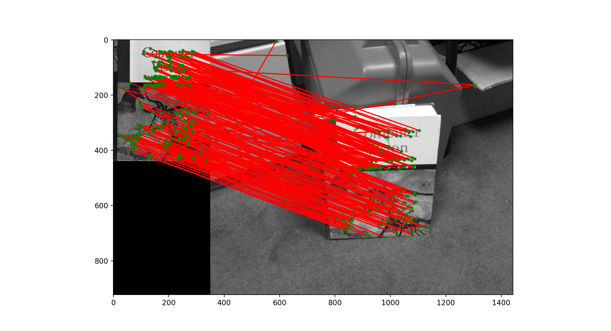

# Panorama Stitcher

## Demostration

- BRIEF feature matching:

  
- Panorama stitching:
  - Original images

     
  - Stitched image
  
    

## Algorithms

- Keypoint detection
  - Difference of Gaussian (DoG) detector
  - SIFT detector
- Feature matching
  - BRIEF feature matching
  - RANSAC